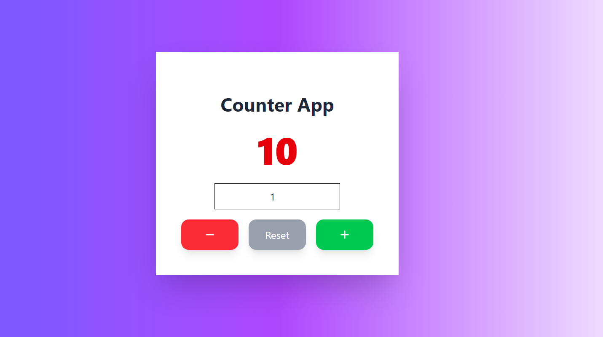

# 🚀 Counter App (React + TailwindCSS)

A simple **Counter Application** built with **React.js** and **TailwindCSS**.  
This app demonstrates basic state management, UI styling, and interactive features.

---

## ✨ Features
- ➕ **Increment Button** → Increases the count
- ➖ **Decrement Button** → Decreases the count
- 🔄 **Reset Button** → Resets the counter to 0
- 🎨 **Modern UI** → Styled with TailwindCSS
- 📱 **Responsive Design** → Works on all screen sizes

---

## 🛠️ Tech Stack
- **React.js** (Frontend)
- **TailwindCSS** (Styling)

---

## 📸 Screenshot
  
*(Add a screenshot of your app here for better presentation)*

---

## 📂 Project Structure
```text
counter-app/
├─ src/
│ ├─ components/
│ │ └─ Counter.jsx
│ ├─ App.jsx
│ └─ main.jsx
├─ public/
│ └─ index.html
├─ package.json
└─ README.md
```
## 🚀 Installation & Usage

1. **Clone the repository:**

```bash
bash
   git clone https://github.com/your-username/counter-app.git
   cd counter-app
```
2.**Install dependencies:**
```bash
npm install
```
3.**start the development server:**
```bash
npm run dev
```

## ⚖️ License
This project is open-source and free to use for learning and personal projects.
Licensed under the MIT License – see the LICENSE file for details.
